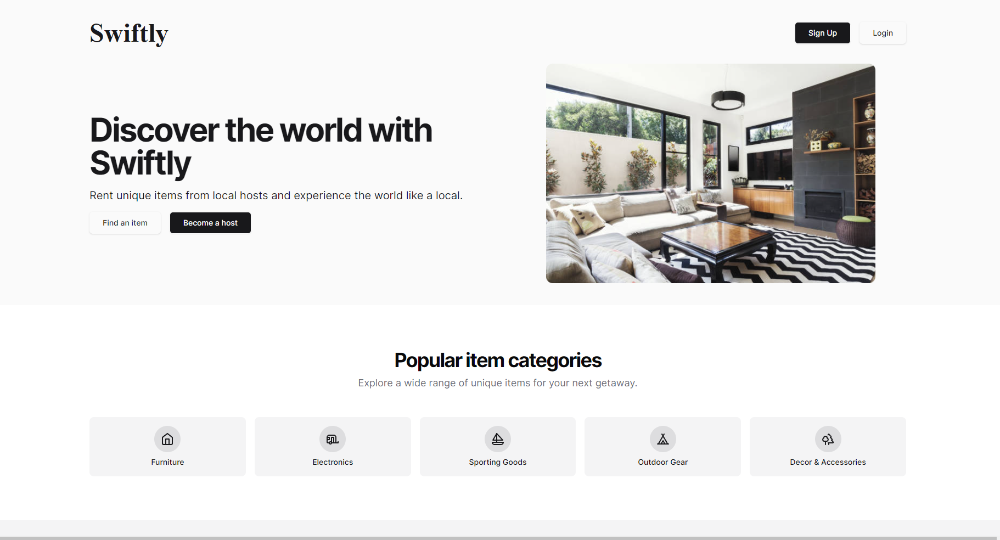

# Swiftly-P2P_Rental
Transform How You Share: Peer-to-Peer Rentals for Everyday Essentials.

-[Live Demo](https://swiftly-drab.vercel.app/)

## About Swiftly
Swiftly is a platform that enables users to rent and lend everyday essentials from and to others in their community. Whether it's a power tool, a bicycle, or camping gear, Swiftly connects people who have items to share with those who need them, promoting sustainability and resource sharing.

## Features
- **Peer-to-Peer Rentals**: Users can easily rent items from other users in their community.
- **Lending**: Users can also lend their own items and earn extra income.
- **Secure Transactions**: Swiftly ensures secure transactions between renters and lenders.
- **Community Building**: Swiftly fosters a sense of community by connecting users within neighborhoods.

## Getting Started
To get started with Swiftly, follow these steps:

### Prerequisites
- Node.js and npm installed on your machine
- Python and Django installed on your machine
- MongoDB installed and running on your system

### Running the Frontend (React)
1. **Navigate to the `frontend` directory**: `cd frontend`
2. **Install Dependencies**: Run `npm install` to install all necessary dependencies.
3. **Run the Development Server**: Use `npm start` to run the React development server.

### Running the Backend (Django)
1. **Navigate to the `backend` directory**: `cd backend`
2. **Install Django Dependencies**: Run `pip install -r requirements.txt` to install all necessary Python dependencies.
3. **Run the Django Server**: Use `python manage.py runserver` to run the Django development server.

### Database Setup (MongoDB)
- Make sure MongoDB is installed and running on your system.
- The Django backend should be configured to connect to the MongoDB database. Refer to the Django documentation or relevant tutorials for details on setting up Django with MongoDB.

## Technologies Used
- React.js
- Django
- MongoDB

## Feedback
If you have any feedback or suggestions for Swiftly, please feel free to open an issue or submit a pull request. We welcome contributions from the community!

Thank you for using Swiftly! Happy renting!
